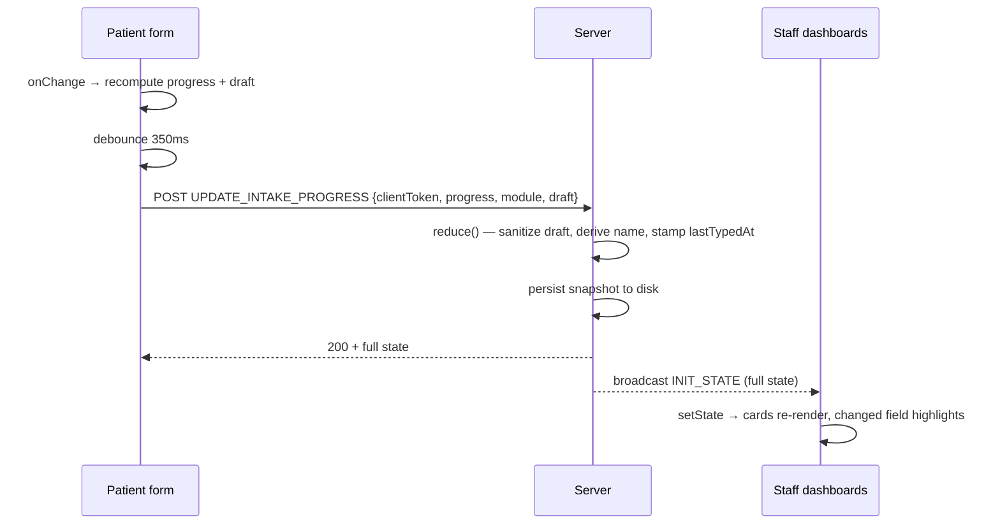

# Design & Planning

How the Health Care intake system is put together, and why. Companion to the
[README](./README.md), which covers running and deploying it.

---

## 1. Project structure

The layout separates **routes** (thin), **shared logic** (pure and tested), and
**presentation** (dumb components).

```
Medical System/
├── server.ts                 Custom Node host: Express + Next.js + WebSocket server
├── Procfile                  Declares the web process for the host
├── README.md / DESIGN.md     Setup and bonus features / this document
├── mobile/                   Expo Go wrapper that loads the app over the LAN
├── app/                      Next.js App Router — routes only
│   ├── layout.tsx            Root layout, self-hosted Inter via next/font
│   ├── globals.css           Tailwind entry + design tokens
│   ├── page.tsx              Landing page: choose patient or staff portal
│   ├── patient-information/  Patient intake route
│   └── staff-system/         Staff dashboard route
└── src/
    ├── types.ts              Domain model (session, record, notification, activity)
    ├── actions.ts            Every client→server message as one typed union
    ├── serverState.ts        Pure reduce(state, action) — all state transitions
    ├── registrationValidation.ts  Shared validation + draft sanitizing
    ├── analytics.ts          Metrics derived from live state
    ├── formatTime.ts         Timestamp → display string
    ├── emergencyCodes.ts     Emergency code/location allowlist
    ├── useModalDismiss.ts    Escape, focus trap, focus restore
    ├── useNow.ts             Interval clock for live relative labels
    ├── components/           Presentation
    └── *.test.ts             Unit tests, colocated with what they test
```

### The organising rule

**`server.ts` does I/O. `src/serverState.ts` does decisions.**

`server.ts` contains no business rules — it wires up HTTP, WebSockets, the
state file, two timers, and shutdown. Every rule about what an action *means*
lives in `serverState.ts` as a pure function:

```ts
reduce(state, action, now) → { state, result, changed }
```

This split is the reason the rules are testable. MRN collisions between two
patients with the same name, session-id reuse after a termination, form
abandonment, and emergency-code rejection are all reachable from a unit test
without starting a server or opening a socket. 34 tests run in about a second.

`src/` is imported by **both** the server and the browser. Validation, types,
and the action union are defined once, so a payload the server would reject is
a compile error in the client rather than a runtime surprise.

---

## 2. Design

### Approach

Mobile-first. Base styles target a phone; `sm`/`md`/`lg`/`xl` progressively add
room. Both audiences are real: patients overwhelmingly arrive on a phone,
staff are usually at a desk but may be on a tablet at the triage desk.

Colour is a small fixed palette — NHS-style blue `#00478d` for actions, green
`#10b981` for submitted, red `#ba1a1a` for emergencies and errors, warm grey
for chrome. Status is never signalled by colour alone: every state also carries
an icon and a text label, so it survives colour-blindness and a greyscale print.

### Patient form

One page, three titled sections — Personal Information, Contact Details,
Emergency Contact & Consent — rather than a multi-step wizard. A wizard hides
how much is left and makes going back to fix a typo expensive. One scrolling
page shows the whole ask up front.

| Width | Layout |
|---|---|
| Base (phone) | Single column, full-width inputs, `h-11` targets for thumbs |
| `md` (768px+) | Name/DOB/contact pair up two-across; emergency block goes three-across |

Errors render **under the field they belong to**, tied by `aria-describedby`,
plus a summary at the top of the form. On submit, focus jumps to the first
invalid field and its section. The alternative — a red border and a summary
list — forces the reader to map messages back onto inputs themselves.

Validation runs in the browser *and* on the server from the same function, so
the rules cannot drift and a direct API call cannot create a junk record.

### Staff dashboard

The dashboard is information-dense, so the navigation moves rather than shrinks:

| Width | Navigation | Session grid |
|---|---|---|
| Base | Bottom tab bar (`lg:hidden`), thumb-reachable | 1 column |
| `md` | Bottom tab bar | 2 columns |
| `lg` (1024px+) | Left sidebar (`hidden lg:flex`), content offset `lg:pl-68` | 2 columns |
| `xl` (1280px+) | Left sidebar | 3 columns |

The header search collapses below `md` and the connection badge below `sm` —
neither is essential on a phone, and both cost width the session cards need.

**Session cards** are the core of the screen. Each shows the live form data as
a two-column definition list: all 14 fields are listed from the start, filled
ones showing the value and unfilled reading `awaiting…`. Fields keep their
position as they fill, so nothing reflows under the reader's eye — a list that
grew as answers arrived would make the card jump while being read.

**Status is three explicit badges**, because "is this patient still with us?"
is the question staff actually have:

| Badge | Meaning |
|---|---|
| `Typing now` | A keystroke within the last 6 seconds |
| `Paused — form open` | Tab still open, no recent typing |
| `Idle — abandoned` | No activity for 5 minutes |
| `Submitted` | Form completed |

Typing is tracked separately from the connection heartbeat. A patient reading
the form is *active* but not *typing*, and conflating the two would show
everyone as permanently typing.

### Honesty as a design rule

Nothing in the UI claims something the system did not do. The message action
records to the activity log and says so, rather than reporting "SMS sent" with
no gateway behind it. Analytics shows zeros on a fresh server instead of
plausible-looking numbers. Times are computed from stored instants, so a
reloaded page never says "just now" about something from yesterday.

---

## 3. Component architecture

### Routes

| File | Role |
|---|---|
| `app/page.tsx` | Landing page; routes to either portal |
| `app/patient-information/page.tsx` | Owns the intake session: mints the client token, debounces updates, submits |
| `app/staff-system/page.tsx` | Owns the socket, the mirrored state, and tab selection; dispatches every staff action |

Both route components are the only stateful containers. Everything in
`src/components/` receives props and calls callbacks — none of them fetch,
open sockets, or know a server exists. That keeps them trivially reusable and
means the sync logic lives in exactly two places.

### Patient-side components

| Component | Responsibility |
|---|---|
| `RegistrationForm` | The whole form: local state, draft persistence to `sessionStorage`, validation, submit and receipt states. Reports `{progress, currentModule, draft}` upward on every change |
| `Field` | One label + control + error message, wired with `aria-describedby`. Also owns the shared input/select/textarea classes |

`Field` exists because error text was previously rendered for only one of nine
validated fields. Making the error a structural part of the field makes it
impossible to add a validated input and forget its message.

### Staff-side components

| Component | Responsibility |
|---|---|
| `Header` | Search, emergency trigger, notifications, about, current user |
| `Sidebar` / `BottomNav` | The same three destinations at different widths |
| `PatientMonitor` | Session grid, status filters, per-card status badge and progress |
| `LiveFormFields` | The mirrored draft for one session — the live view itself |
| `PatientRecords` | Search, record detail, triage notes and priority |
| `AnalyticsView` | Renders metrics; all arithmetic lives in `analytics.ts` |
| `NotificationsModal` | Notifications plus persistent activity history |
| `EmergencyAlertModal` | Composes a broadcast from the shared allowlist |
| `ConfirmationModal` / `AboutModal` | Confirmations for destructive actions; system info |

### Shared hooks

`useModalDismiss` gives every dialog the same behaviour — Escape to close,
focus into the dialog on open, focus trapped while open, focus restored on
close. `useNow` re-renders on an interval so relative labels and the typing
indicator decay on their own rather than freezing between broadcasts.

---

## 4. Real-time sync flow

### Transport split

Two directions, two mechanisms, deliberately:

- **Client → server: HTTP `POST /api/action`.** A WebSocket can report `OPEN`
  in a mobile WebView and still fail to deliver. A POST either succeeds or
  returns an error the UI can act on, and it carries server-assigned
  identifiers straight back to the caller that needs them.
- **Server → all clients: WebSocket broadcast.** One authoritative push to
  every connected screen.

### The path of one keystroke



### Why the whole state, every time

Each broadcast carries the complete `AppState`, not a delta. At this scale the
payload is small, and it buys three things: a client that misses a message is
corrected by the next one; a reconnecting client needs no replay log; and
there is exactly one code path to reason about. If the dataset grew, this is
the first thing that would need revisiting.

### Identity and idempotency

The patient's browser mints an opaque `clientToken` and keeps it in
`sessionStorage`. The **server** owns every display identifier — session id,
MRN, record id — and returns them in the action result. Because the server
keys sessions on the token, a refresh, a retry, or React's development
double-effect resumes the same session instead of spawning a duplicate row on
the staff monitor. Sequence counters are persisted, so a terminated session
never frees its number for a later patient to inherit.

### Resilience

| Mechanism | Interval | Purpose |
|---|---|---|
| Update debounce | 350 ms | One request per burst of typing |
| Session heartbeat | 25 s | Keeps an open-but-idle form alive |
| WebSocket ping/pong | 30 s | Drops connections that never sent `close` |
| Reconnect backoff | 1s → 30s | `min(30_000, 1000 × 2^attempt)`, avoids a reconnect storm |
| HTTP poll fallback | 5 s | **Only** while the socket is not `OPEN` |
| Background tick | 4 s | Ages out abandoned forms; advances demo sessions |
| Abandonment | 5 min | Marks a form idle |

The connection badge reports which path is live — WebSocket, HTTP fallback, or
connecting — so staff can tell a quiet clinic from a broken feed.

### Persistence

State is written to `data/medical-state.json` write-then-rename, so a crash
mid-write cannot truncate the snapshot. Snapshots carry a schema version and
are rejected wholesale if incompatible, falling back to seed data rather than
loading half a state. A failed write logs and continues in memory: a disk
problem must not stop an intake in progress.

**All timestamps are stored as epoch milliseconds and formatted at render.**
Storing `"Just now"` or `"Today"` is only true at the moment it is written and
becomes a lie after a restart. Clinical dates are additionally pinned to a
fixed locale and the Gregorian calendar — on a machine with a Thai locale the
default rendering turns a 1982 date of birth into `2525` in the Buddhist era,
which would mean two staff reading different dates off the same record.
